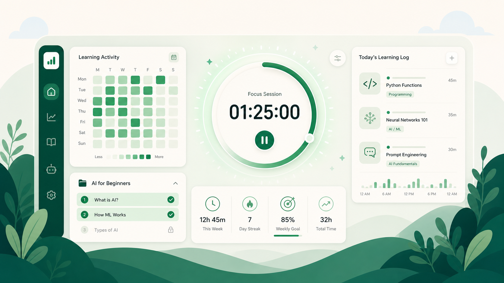

# AI Learning Tracker

[English](#english) | [简体中文](#简体中文)

一个面向 AI、编程和软件开发学习者的本地优先学习追踪工具。记录每日学习、保持专注节奏，并将学习计划转化为可完成的路径。



## 功能

- 每日学习记录、学习目标和连续打卡
- 实时专注计时器：开始、休息、继续与结束自动记入当天时长
- 自然月学习热力图；点击日期查看当天学习内容与时长
- 中文 / English 界面切换
- 内置 **AI for Beginners** 学习计划，支持逐课完成、折叠展示与中英文课程跳转
- 所有数据保存在浏览器本地，无需账号或后端

## 本地运行

需要 Node.js 22.13 或更高版本。

```bash
pnpm install
pnpm exec vinext dev
```

打开 `http://localhost:3000`。

构建验证：

```bash
pnpm exec vinext build
```

## 数据与隐私

学习记录、课程完成状态和进行中的计时都保存在浏览器的 Local Storage。清除浏览器网站数据会删除它们；目前尚未提供跨设备同步。

## 课程来源

内置计划整理自 [blueboy-bot/AI-For-Beginners](https://github.com/blueboy-bot/AI-For-Beginners)，该课程采用 MIT 许可证。课程内容及其商标归原项目贡献者所有。

## 贡献

欢迎提交 Issue 和 Pull Request。提交较大的功能前，建议先建立 Issue 讨论设计。

## 许可证

本项目采用 [MIT License](LICENSE)。

---

## English

AI Learning Tracker is a local-first learning tracker for people studying AI, programming, and software development.

### Highlights

- Daily logs, goals, and learning streaks
- Live focus timer with start, break, resume, and automatic session logging
- Monthly activity calendar with day-level learning details
- Chinese / English interface
- Built-in AI for Beginners checklist with progress tracking and language-aware lesson links
- No account, backend, or cloud data collection required

### Run locally

```bash
pnpm install
pnpm exec vinext dev
```

Visit `http://localhost:3000`.

## License

MIT © 2026 AI Learning Tracker Contributors
